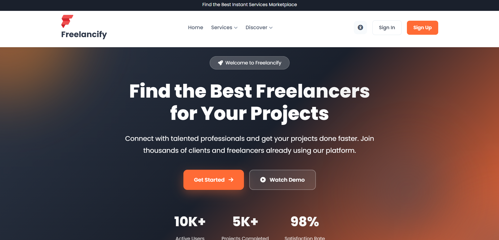
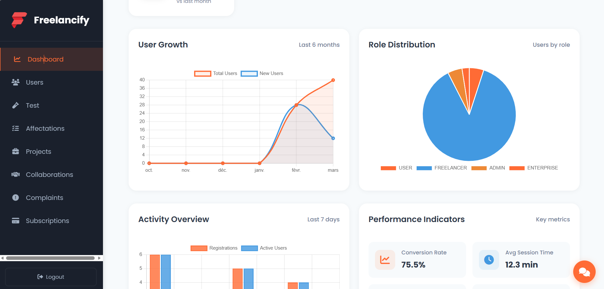
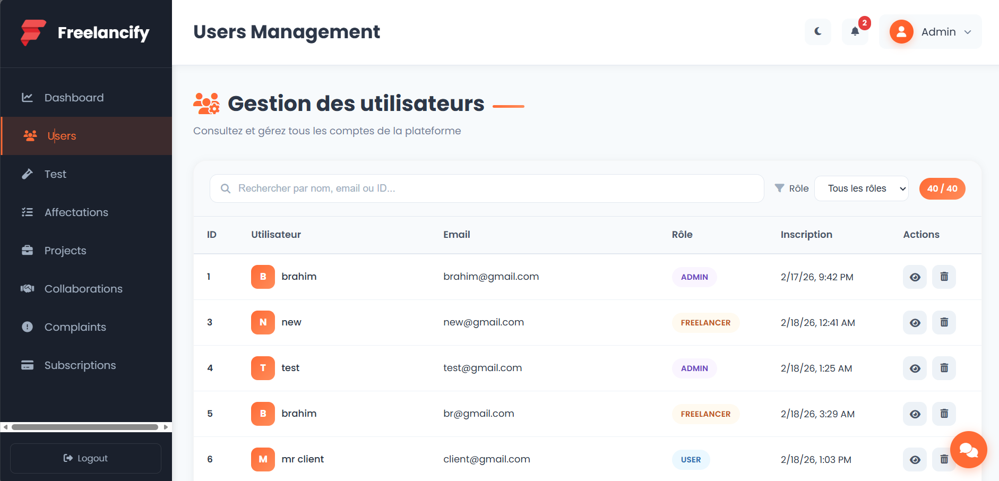
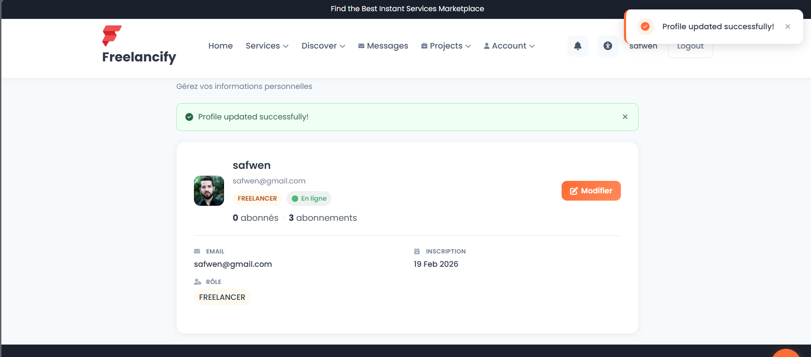
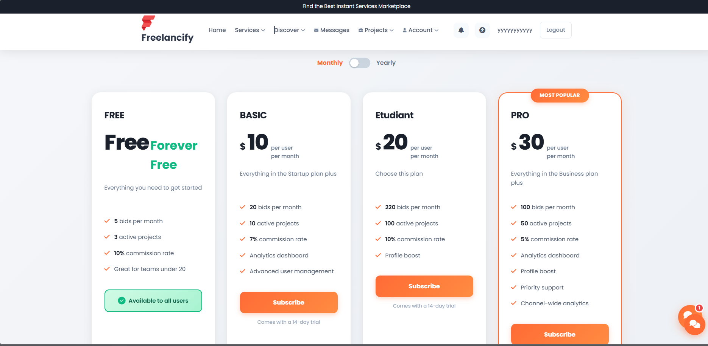

# Freelancify — Plateforme de gestion freelance

**Projet réalisé dans le cadre de l'Esprit School of Engineering - Tunisia**  
**Année universitaire : 2025-2026**

Plateforme web full-stack permettant de connecter clients et freelances : gestion de projets, abonnements, réclamations, tests de compétences et collaboration, le tout via une architecture microservices et une API Gateway.

---

## Overview

Freelancify est une application de type marketplace pour freelances : les utilisateurs (clients ou freelances) peuvent publier des projets, soumettre des propositions, gérer des abonnements (plans FREE, BASIC, PRO), déposer des réclamations et passer des tests techniques. L’administration dispose d’un tableau de bord, de la gestion des utilisateurs, des projets, des réclamations, des abonnements et des affectations de tests.

Tous les appels du frontend passent par une **API Gateway** (port 8090), qui route vers les microservices (user, project, collaboration, complaints, subscription, service-test) enregistrés sur **Eureka**. L’authentification est gérée par **Keycloak** (OAuth2 / JWT).

---

## Features

| Domaine | Fonctionnalités |
|--------|------------------|
| **Utilisateurs** | Inscription, profil, rôles (USER, FREELANCER, ADMIN), synchronisation Keycloak, messagerie, suivi (follow), notations, posts, notifications, chat, appels vidéo |
| **Projets** | CRUD projets, propositions (proposals), tâches, statistiques, filtres par statut/catégorie |
| **Collaboration** | Demandes de collaboration, négociations, workspace (tâches, sprints, milestones, time logs), équipes |
| **Réclamations & pénalités** | Dépôt de réclamations (claims), pièces jointes, workflow admin, pénalités automatiques ou manuelles |
| **Abonnements** | Plans (FREE, BASIC, PRO), création/annulation d’abonnement, webhook paiement, analytics admin |
| **Tests** | Questions (QCM, coding), affectations de tests, exécution de code, vérification faciale (CompreFace), feedback IA (Gemini) |
| **Admin** | Dashboard, gestion users/projets/réclamations/abonnements/affectations, statistiques |

---

## Tech Stack

| Couche | Technologies |
|--------|---------------|
| **Frontend** | Angular 17, RxJS, Keycloak Angular, Chart.js, ngx-translate |
| **API Gateway** | Spring Cloud Gateway (WebFlux), port 8090, CORS unifié |
| **Service discovery** | Netflix Eureka (port 8761) |
| **Microservices (Backend)** | Spring Boot 3.1/3.2, Spring Security (OAuth2 Resource Server), JPA/Hibernate, MySQL, WebSocket (user-service), Spring Cloud (Eureka client) |
| **Auth** | Keycloak (OAuth2, JWT), port 8080 |
| **Bases de données** | MySQL (par service ou schéma dédié) |
| **Divers** | Maven, REST, ImgBB (upload images), CompreFace (face verification), Gemini (IA) |

---

## Architecture

Le frontend (Angular) appelle **uniquement** l’API Gateway. Le gateway route les requêtes vers le bon microservice selon l’URL (ex. `/user`, `/project`, `/complaints`, `/api/subscriptions`, `/service-test`, `/collaboration`) et réécrit les chemins si besoin (ex. `/user` → `/api/users`, `/complaints/...` → `/freelancity/...`).

```
                    ┌─────────────────────────────────────────────────────────┐
                    │                    Navigateur (Angular)                  │
                    │                   http://localhost:4200                  │
                    └─────────────────────────────┬───────────────────────────┘
                                                  │
                                                  │ HTTP (JWT)
                                                  ▼
                    ┌─────────────────────────────────────────────────────────┐
                    │                   API Gateway (8090)                      │
                    │  Routes : /user, /project, /complaints, /api/subscriptions│
                    │  /service-test, /collaboration, /api/posts, /ws, ...     │
                    └─────────────────────────────┬───────────────────────────┘
                                                  │
                    ┌─────────────────────────────┼─────────────────────────────┐
                    │         Eureka (8761)       │                             │
                    └─────────────────────────────┼─────────────────────────────┘
                      │           │         │     │         │            │
                      ▼           ▼         ▼     ▼         ▼            ▼
              ┌──────────┐ ┌──────────┐ ┌──────┐ ┌────────┐ ┌──────────┐ ┌────────┐
              │  User    │ │ Project  │ │Collabor│ │Complaints│ │Subscription│ │Service │
              │ Service  │ │ Service  │ │Service │ │ Service │ │ Service  │ │ Test   │
              │ (8081)   │ │ (8082)   │ │(8083) │ │ (8092)  │ │ (8091)   │ │ (8089) │
              └──────────┘ └──────────┘ └──────┘ └────────┘ └──────────┘ └────────┘
```

### Screenshots

Captures d’écran du projet (dossier `docs/screenshots/`).

**Aperçu des écrans :**

<p align="center">
  <strong>Page d'accueil / Login</strong><br>
  
</p>

<p align="center">
  <strong>Dashboard admin</strong><br>
  
</p>

<p align="center">
  <strong>Liste des utilisateurs</strong><br>
  
</p>

<p align="center">
  <strong>Liste des projets</strong><br>
  
</p>

<p align="center">
  <strong>Profil utilisateur</strong><br>
  
</p>

<p align="center">
  <strong>Réclamations</strong><br>
  
</p>

<p align="center">
  <strong>Abonnements</strong><br>
  
</p>

<p align="center">
  <strong>Architecture / API</strong><br>
  
</p>

---

## Project structure

```
freelance-management/
├── ApiGateway4sae2/          # API Gateway (Spring Cloud Gateway), port 8090
├── Eureka/                   # Service discovery (Netflix Eureka), port 8761
├── services/
│   ├── backend1/             # User service (users, posts, messages, follow, notifications, etc.), 8081
│   ├── project-service/     # Projets, propositions, tâches, 8082
│   ├── collaboration-service/ # Collaborations, workspace, 8083
│   ├── complaints-service/  # Réclamations, pénalités, 8092
│   ├── subscription-service/# Abonnements, plans, 8091
│   └── testService/
│       └── service-test/    # Tests, affectations, exécution code, face verify, 8089
├── projet/projet/projet/
│   └── frontend/            # Application Angular 17 (port 4200)
├── docs/
│   └── screenshots/         # Captures d’écran (home, dashboard, users, projects, etc.)
└── README.md
```

---

## Academic context

- **Établissement :** Esprit School of Engineering - Tunisia  
- **Année universitaire :** 2025-2026  
- **Contexte :** Projet de fin d’études / projet d’intégration (selon votre mention exacte).  
- **Objectifs pédagogiques :** Mise en œuvre d’une architecture microservices (Spring Boot, Eureka, API Gateway), frontend moderne (Angular), sécurisation (Keycloak/OAuth2/JWT), et intégration de services (paiements, réclamations, tests techniques, IA).

---

## Getting started

### Prérequis

- **JDK 17**
- **Node.js 18+** et **npm**
- **MySQL** (local ou distant)
- **Keycloak** (ex. port 8080) avec un realm et un client configurés
- **Maven 3.8+**

### Ordre de démarrage

1. **MySQL** : démarrer le serveur et créer les bases (ou laisser les services les créer au premier run).
2. **Keycloak** : lancer Keycloak, créer le realm `projetpidev` et le client `freelance-client` (ou adapter les configs).
3. **Eureka** : depuis la racine du projet, `cd Eureka` puis `mvn spring-boot:run` (port 8761).
4. **API Gateway** : `cd ApiGateway4sae2` puis `mvn spring-boot:run` (port 8090).
5. **Microservices** (dans l’ordre souhaité, ex.) :
   - `services/backend1` (user-service) — 8081  
   - `services/project-service` — 8082  
   - `services/collaboration-service` — 8083  
   - `services/complaints-service` — 8092  
   - `services/subscription-service` — 8091  
   - `services/testService/service-test` — 8089  
6. **Frontend** : `cd projet/projet/projet/frontend`, `npm install`, `npm start` (port 4200).

### Configuration frontend

- Fichiers d’environnement : `projet/projet/projet/frontend/src/environments/environment.ts` (dev) et `environment.prod.ts` (prod).
- Toutes les URLs backend passent par `apiGatewayUrl` (ex. `http://localhost:8090` en dev). Keycloak : `keycloakUrl`, `keycloakRealm`, `keycloakClientId`.

### Accès

- **Frontend :** http://localhost:4200  
- **API Gateway :** http://localhost:8090 (point d’entrée unique pour le frontend)  
- **Eureka Dashboard :** http://localhost:8761  
- **Keycloak Admin :** http://localhost:8080  

---

## Contributors

**Équipe Alpha** — Esprit School of Engineering - Tunisia, 2025-2026

| Membre | Rôle |
|--------|------|
| **Mohamed Brahim Garram** | 🧪 Gestion des tests — affectations, exécution de code, vérification faciale |
| **Sahem Omrane** | 📋 Gestion des projets — CRUD, propositions, tâches, statistiques |
| **Adam Abidi** | 🤝 Gestion de la collaboration — workspace, sprints, milestones, équipes |
| **Safwen Souissi** | 📝 Gestion des réclamations et abonnements — plans, workflow, analytics |

---

## Topics (étiquettes suggérées pour le dépôt Git)

`angular` `spring-boot` `microservices` `eureka` `api-gateway` `keycloak` `oauth2` `mysql` `freelance` `esprit` `tunisia`

---

*README — Esprit School of Engineering - Tunisia, année universitaire 2025-2026.*
