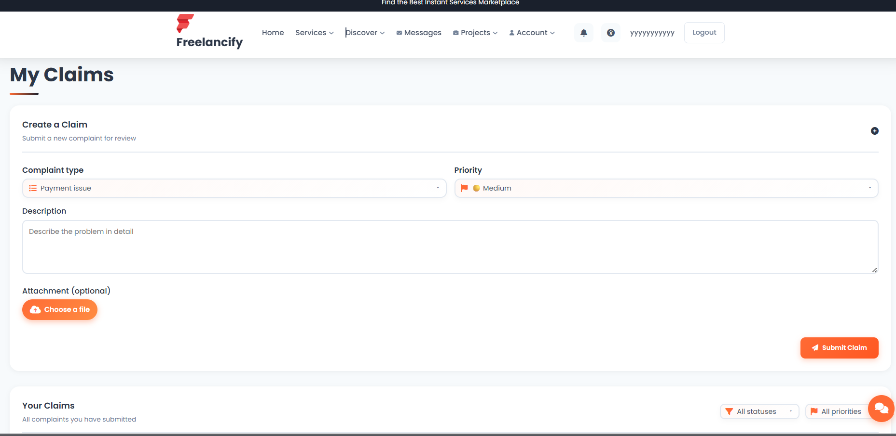

<div align="center">

# 🚀 Freelance Management Platform

**Microservices Architecture — Connect clients & freelancers**

[](https://openjdk.org/)
[](https://angular.io/)
[](https://spring.io/)
[](https://www.keycloak.org/)
[](https://www.mysql.com/)

</div>

---

## 📌 Overview

A **Freelance Management Platform** built with a **microservices architecture**, enabling clients and freelancers to collaborate through dedicated services. All traffic goes through an **API Gateway**; authentication is handled by **Keycloak** (OAuth2 / JWT).

| Domain | Description |
|--------|--------------|
| 📝 **Posts** | Publish and manage posts (clients & freelancers) |
| 🧪 **Tests** | Technical tests and evaluations |
| 💳 **Payments** | Payments and transactions |
| 📋 **Complaints** | User complaints and support (reclamations) |
| 📁 **Projects** | Freelance projects and assignments |

- **Backend:** Spring Boot microservices behind an **API Gateway**
- **Frontend:** Angular SPA
- **Auth:** Keycloak (login, roles, JWT)
- **Data:** Centralized database for freelance-related data

---

## ✨ Features

| Domain | Features |
|--------|----------|
| **Users** | Registration, profile, roles (Admin, Client, Freelancer), Keycloak sync, messaging, follow, ratings, posts, notifications |
| **Projects** | CRUD projects, proposals, tasks, statistics, filters by status/category |
| **Collaboration** | Collaboration requests, workspace (tasks, sprints, milestones), teams |
| **Complaints** | Claim submission, attachments, admin workflow, penalties |
| **Subscriptions** | Plans (e.g. FREE, BASIC, PRO), create/cancel subscription, payment webhooks, admin analytics |
| **Tests** | Technical tests (QCM, coding), assignments, code execution, face verification |
| **Admin** | Dashboard, user/project/complaint/subscription management, statistics |

---

## ⚙️ Tech Stack

<table>
<tr>
<td width="33%">

**Backend**
- Java 17+
- Spring Boot
- Spring Cloud Gateway
- Spring Cloud Netflix Eureka
- Spring Security
- Keycloak

</td>
<td width="33%">

**Frontend**
- Angular
- TypeScript
- Bootstrap / Material UI

</td>
<td width="33%">

**Data & tools**
- MySQL
- REST APIs
- Maven

</td>
</tr>
</table>

---

## 🏗️ Architecture

```
┌─────────────┐     ┌─────────────┐     ┌─────────────────┐     ┌──────────────────┐     ┌──────────┐
│   Client    │────▶│   Angular   │────▶│   API Gateway   │────▶│  Microservices   │────▶│ Database │
│   (User)    │     │  Frontend   │     │  (single entry) │     │  (Spring Boot)   │     │  (MySQL) │
└─────────────┘     └─────────────┘     └─────────────────┘     └──────────────────┘     └──────────┘
```

| Service | Role |
|---------|------|
| **User Service** | User management, secured with Keycloak |
| **Post Service** | Posts published by clients/freelancers |
| **Test Service** | Technical tests and evaluations |
| **Payment Service** | Payments and transactions |
| **Reclamation Service** | Complaints and support requests |
| **Project Service** | Freelance projects and assignments |

---

## 🔐 Authentication — Keycloak

| Feature | Description |
|---------|-------------|
| 🔒 **Login & registration** | Secure sign-up and sign-in |
| 👥 **Roles** | Admin, Client, Freelancer |
| 🎫 **JWT** | Token-based authentication |
| 🏠 **Identity** | Centralized user management |

---

## 📸 Screenshots

*Click on an image to open it in full size.*

<table>
<tr>
<td align="center" width="33%"><strong>Home / Login</strong><br><a href="docs/screenshots/home.png" target="_blank"></a></td>
<td align="center" width="33%"><strong>Dashboard</strong><br><a href="docs/screenshots/dashboard.png" target="_blank"></a></td>
<td align="center" width="33%"><strong>Users</strong><br><a href="docs/screenshots/users.png" target="_blank"></a></td>
</tr>
<tr>
<td align="center" width="33%"><strong>Profile</strong><br><a href="docs/screenshots/profile.png" target="_blank"></a></td>
<td align="center" width="33%"><strong>Complaints</strong><br><a href="docs/screenshots/compaints.png" target="_blank"></a></td>
<td align="center" width="33%"><strong>Subscriptions</strong><br><a href="docs/screenshots/subscriptions.png" target="_blank"></a></td>
</tr>
</table>

---

## 🎓 Academic Context

| | |
|--|--|
| **Institution** | Esprit School of Engineering - Tunisia |
| **Academic year** | 2025-2026 |
| **Context** | Final year / integration project (PIDEV 4SAE2) |
| **Objectives** | Microservices (Spring Boot, Eureka, API Gateway), modern frontend (Angular), security (Keycloak/OAuth2/JWT), and integration of payments, complaints, and technical tests. |

---

## 🚀 Getting Started

### Prerequisites

- **JDK 17+**
- **Node.js 18+** and **npm**
- **MySQL** (local or remote)
- **Keycloak** (e.g. port 8080) with realm and client configured
- **Maven 3.8+**

### Startup order

1. **MySQL** — Start the server and create databases (or let services create them on first run).
2. **Keycloak** — Run Keycloak, create realm and client (e.g. `freelance-client`).
3. **Eureka** — From project root: `cd Eureka` then `mvn spring-boot:run` (port 8761).
4. **API Gateway** — `cd ApiGateway4sae2` then `mvn spring-boot:run` (port 8090).
5. **Microservices** — Start each service (user, project, collaboration, complaints, subscription, test) from their directories.
6. **Frontend** — `cd projet/projet/projet/frontend`, `npm install`, `npm start` (port 4200).

### Access

| Service | URL |
|---------|-----|
| **Frontend** | http://localhost:4200 |
| **API Gateway** | http://localhost:8090 |
| **Eureka Dashboard** | http://localhost:8761 |
| **Keycloak Admin** | http://localhost:8080 |

---

## 👥 Contributors

**Team Alpha** — Esprit School of Engineering - Tunisia, 2025-2026

| Member | Role |
|--------|------|
| **Mohamed Brahim Garram** | 🧪 Tests — assignments, code execution, face verification |
| **Sahem Omrane** | 📋 Projects — CRUD, proposals, tasks, statistics |
| **Adam Abidi** | 🤝 Collaboration — workspace, sprints, milestones, teams |
| **Safwen Souissi** | 📝 Complaints & subscriptions — plans, workflow, analytics |

---

<div align="center">

*Built with Spring Boot & Angular — Microservices Architecture*

</div>
